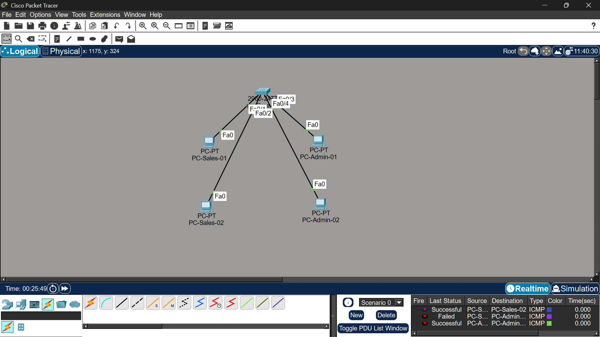

# Lab 02 - VLAN Segmentation

## Scenario

After successfully deploying the initial office network, **Zintan Tech Solutions (ZTS)** expanded its operations and created two separate departments:

- Sales Department
- Administration Department

As the Junior Network Engineer, my task was to separate both departments into different Virtual Local Area Networks (VLANs) to improve network organization, security, and traffic management.

---

## Objective

- Create VLAN 10 (Sales)
- Create VLAN 20 (Administration)
- Assign switch ports to the correct VLAN
- Configure static IP addresses
- Verify communication within each VLAN
- Observe the communication failure between different VLANs

---

## Network Topology

---

## Devices

| Device | Hostname |
|---------|----------|
| Switch | SW-Core-01 |
| PC | PC-Sales-01 |
| PC | PC-Sales-02 |
| PC | PC-Admin-01 |
| PC | PC-Admin-02 |

---

## VLAN Configuration

| VLAN ID | Name | Assigned Ports |
|---------|------|----------------|
| 10 | Sales | Fa0/1, Fa0/2 |
| 20 | Administration | Fa0/3, Fa0/4 |

---

## IP Addressing

| Device | IP Address | VLAN |
|---------|------------|------|
| PC-Sales-01 | 192.168.10.10/24 | VLAN 10 |
| PC-Sales-02 | 192.168.10.11/24 | VLAN 10 |
| PC-Admin-01 | 192.168.20.10/24 | VLAN 20 |
| PC-Admin-02 | 192.168.20.11/24 | VLAN 20 |

---

## Verification

### VLAN Configuration

### Connectivity Test

- Successful communication between devices inside VLAN 10.
- Successful communication between devices inside VLAN 20.
- Communication between VLAN 10 and VLAN 20 failed as expected.

---

## Challenges

Initially, I expected all devices connected to the same switch to communicate with each other.

After completing the lab, I learned that each VLAN creates a separate **Broadcast Domain**, which isolates network traffic between departments.

Communication between different VLANs requires a **Layer 3 Device** (Router or Layer 3 Switch) to perform **Inter-VLAN Routing**.

---

## Skills Learned

- VLAN Fundamentals
- Creating VLANs
- Assigning Switch Ports to VLANs
- Static IP Addressing
- VLAN Verification
- Basic Network Segmentation
- Network Documentation

---

## Technologies Used

- Cisco Packet Tracer
- Cisco IOS CLI
- Git
- GitHub

---

## Future Improvements

In the next lab, a router will be introduced to enable communication between different VLANs using **Inter-VLAN Routing**.